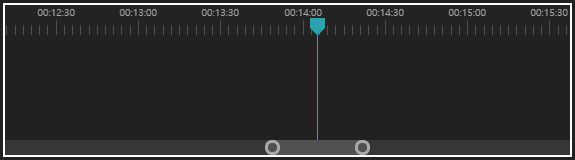

<h2 align="middle">BiScrollbar</h2>
<p align="middle">
  <a href="https://www.npmjs.com/package/@orange4glace/biscrollbar" target="_blank"></a>
  
  
</p>

<p align="middle" style="font-weight: bold">
  A Premiere pro style Scrollbar UI component
</p>
<p align="middle" ></p>

### [Demo](https://codesandbox.io/s/guide-biscrollbar-2w6nd)
with [@orange4glace/guide](https://github.com/orange4glace/guide)

## Installation
### npm
```sh
$ npm install --save @orange4glace/biscrollbar
```

### script
```html
<script src="./biscrollbar.min.js"></script>
```

## Example
```ts
import { BiScrollbar } from 'lib/biscrollbar';

const container = document.getElementById('container');
container.style.width = '100%';
container.style.height = '20px';

const sc = new BiScrollbar(container);
sc.layout(container.offsetWidth, container.offsetHeight);
sc.setSize(2000);
sc.setRagne(1400, 1600);
sc.pivot = 1500;
sc.pivottingOnlyPivotVisible = true;
const disposable = sc.onChange(() => {
  console.log('Changed', sc.start, sc.end);
});
disposable.dispose();
```